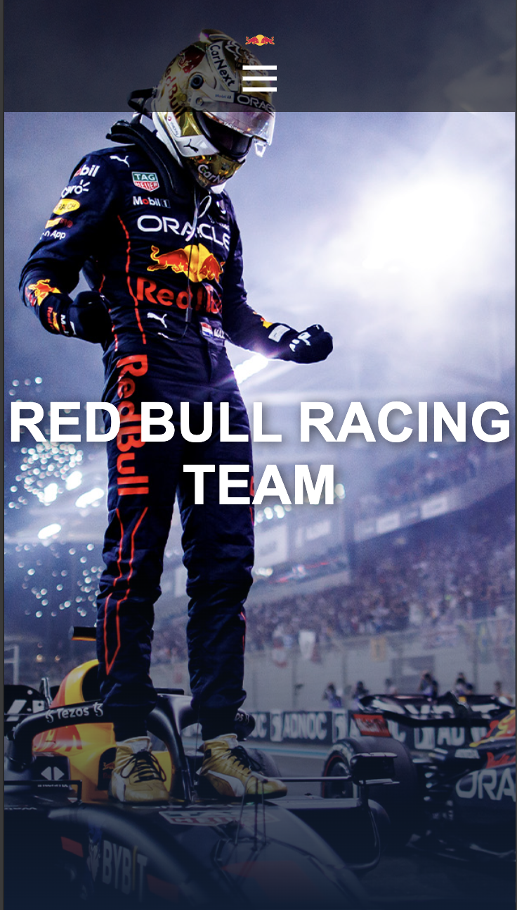

# Red Bull Racing Team Website

This is a responsive website for the Red Bull Racing Team, built with HTML and CSS. It showcases information about the team, drivers, car details, and includes a contact form. A responsive navigation bar with a hamburger menu is implemented for easy navigation on mobile devices.

## Table of Contents

- [Overview](#overview)
- [Features](#features)
- [Technologies Used](#technologies-used)
- [Usage](#usage)
- [Responsive Design](#responsive-design)
- [Screenshots](#screenshots)
- [License](#license)

## Overview

The Red Bull Racing Team website is designed to be a simple, informative, and responsive platform where fans and visitors can explore details about the team, drivers, and the car used in competitions. This project is a single-page layout with different sections, including a hero section, about section, drivers section, car details, and a contact form.

## Features

- **Responsive Navigation Bar**: Includes a sticky navbar with links to different sections. On smaller screens, a hamburger menu appears, allowing users to toggle the navigation.
- **Hero Section**: Displays the team's title prominently.
- **About Section**: Gives a brief introduction to the Red Bull Racing Team.
- **Drivers Section**: Showcases driver profiles with images and achievements.
- **Car Section**: Highlights the current racing car model with a background text effect.
- **Contact Section**: Contains a form for visitors to send inquiries, including fields for name, email, and a message.
- **Sticky Navbar and Hamburger Menu**: Navbar remains visible when scrolling, and a responsive hamburger menu ensures easy navigation on mobile devices.

## Technologies Used

- **HTML5**: For structuring the content.
- **CSS3**: For styling, including flexbox, grid, media queries, and animations.

## Usage

1. Clone the project repository:
   ```bash
   git clone https://github.com/rifqi-16/module-1-rifqi-16.git
   ```
2. Navigate to the project directory:
   ```bash
   cd module-1-rifqi-16
   ```
3. Open the `index.html` file in your browser:
   ```bash
   open index.html
   ```
4. **Img Folder** (img folder will located outside the project for development purpose) to call it into html you can use " ../ " :

   ```

   <img src="/Users/muhamadrifqiramadani/Documents/Tugas Revou 1/module-1-Rifqi-16/img/Max Verstappen.avif"
   ```

## Responsive Design

The website is designed to be fully responsive. The layout adjusts based on the screen size using CSS media queries:

- **Desktop**: Full layout with larger text and images.
- **Tablet**: Font sizes and padding adjust, and sections stack vertically as needed.
- **Mobile**: Navbar becomes a hamburger menu, sections are resized for readability, and the sticky navbar ensures easy access to the menu.

### Media Queries

The CSS includes breakpoints for:

- **1024px and below**: Adjusts font sizes and padding for tablets.
- **768px and below**: Switches navbar to hamburger mode, stacks elements vertically.
- **480px and below**: Further adjusts font sizes and image dimensions for small mobile screens.

## Screenshots

### Desktop View


### Mobile View



## License

This project is open-source and available under the MIT License.
